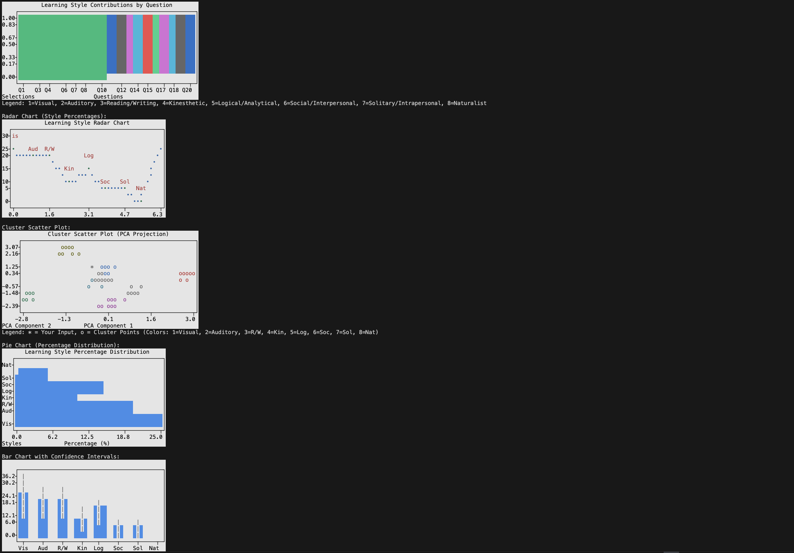

# BTech Learning Style Quiz

## Overview

This Python script identifies a BTech student's learning style through a quiz with 20 questions, each offering 8 options mapped to learning styles: Visual, Auditory, Reading/Writing, Kinesthetic, Logical/Analytical, Social/Interpersonal, Solitary/Intrapersonal, and Naturalist. It uses three prediction methods—rule-based, KMeans clustering, and API-based (Google Gemini)—to classify styles, with tie-breaker questions for resolving equal style counts and visualizations using the `plotext` library.

## Features

### Quiz

- 20 questions with 8 options per question, covering learning preferences.

### Tie-Breaker Case

- If multiple styles tie for the highest count, additional questions (up to 5) are asked for tied styles to determine the dominant style.

### Prediction Methods

- **Rule-Based**: Counts selections to compute percentages and descriptions.
- **KMeans Clustering**: Groups synthetic data into 8 style clusters, projecting user input for comparison.
- **API-Based**: Uses Google Gemini API for advanced classification, falling back to rule-based if it fails.

### Visualizations

- **Stacked Bar Chart**: Shows per-question contributions to learning styles.
- **Radar Chart**: Displays style percentages radially.
- **Cluster Scatter Plot**: Visualizes user data against style clusters using PCA.
- **Pie Chart**: Represents style percentages as a horizontal bar chart.
- **Bar Chart with Confidence Intervals**: Shows percentages with error bars for statistical reliability.

## Setup

### 1. Clone the Repository

```bash
git clone [https://github.com/AshwinderPalSingh/Learning-style-classifier.git]

```

### 2. Install Dependencies

```bash
pip install numpy scikit-learn plotext google-generativeai
```

### 3. Set Up Google Gemini API

- Obtain your API key from Google AI Studio.
- Replace the line in `learning_style_quiz.py`:

```python
API_KEY = "YOUR_API_KEY_HERE"
```

## Usage

### Running the Script

```bash
python learning_style_quiz.py
```

### Answering the Quiz

- Answer 20 questions by selecting 1-8 options.
- If a tie occurs (e.g., Visual and Auditory both have 6 selections), up to 5 tie-breaker questions are asked for tied styles.
- View results: style percentages, descriptions, and visualizations from all three prediction methods.

## Tie-Breaker Case

### Trigger

Occurs when two or more styles have the same highest selection count after 20 questions (e.g., Visual: 6, Auditory: 6, others lower).

### Process

Randomly selects questions from `tie_breaker_questions` for tied styles (e.g., Visual vs. Other, Auditory vs. Other). Users choose 1-2 options, and selections increment style counts.

### Resolution

The style with the most tie-breaker selections wins. If still tied, the style with the lowest index is chosen in the following order:

Visual > Auditory > Reading/Writing > Kinesthetic > Logical/Analytical > Social/Interpersonal > Solitary/Intrapersonal > Naturalist

### Function

```python
ask_tie_breaker_questions(tied_styles, max_additional=5)
```

## Prediction Methods

### Rule-Based Prediction

- Counts selections from 20 questions and tie-breakers (if any).
- Each selection increments the corresponding style’s count.
- Calculates percentages (count/total answers * 100) and forms a description (e.g., "Visual-cum-Auditory") using the highest and second-highest counts.
- Ties are resolved using the fixed style order.

**Function**: `rule_based_predict(raw_answers, additional_answers, tied_styles)`

### KMeans Clustering Prediction

- Generates 1600 synthetic profiles (200 per style) with a 98% bias toward the dominant style.
- User answers form a 160D vector (20 questions * 8 styles).
- PCA reduces dimensionality to 2D. KMeans (8 clusters, n_init=30, max_iter=1000) clusters synthetic data. User vector is projected and assigned to a cluster.
- Dominant style is determined by the cluster’s mean vector.

**Functions**:
- `generate_synthetic_data()`
- `build_model()`
- `kmeans_predict(user_vector, kmeans, data)`

### API-Based Prediction

- Sends questions, user answers, and tie-breaker responses to Google Gemini API, which computes percentages and a description.
- Falls back to rule-based if API fails (e.g., connectivity issues).

**Function**: `api_classify_learning_style(questions, raw_answers, additional_answers, tied_styles)`

## Visualizations

- **Stacked Bar Chart**: Shows style contributions per question (Q1-Q20, T1-T5 for tie-breakers).
- **Radar Chart**: Displays style percentages in a radial format.
- **Cluster Scatter Plot**: Plots user data (*) against synthetic clusters (o) in 2D PCA space, colored by style (1=Visual, 2=Auditory, etc.).
- **Pie Chart**: Uses a horizontal bar chart for style percentages.
- **Bar Chart with Confidence Intervals**: Shows percentages with error bars for statistical confidence.

## Example Visualization Output

Screenshot of classified solution :




## Silhouette Score

### Purpose

Measures KMeans clustering quality for synthetic data.

### How Achieved

- Synthetic data’s 98% bias ensures distinct clusters.
- KMeans uses `n_init=30`, `max_iter=1000` for robust convergence.
- Score (~0.9) indicates tight, well-separated clusters.

### Usage

Printed during model building to confirm reliable clustering.

**Function**: `build_model()`

## Code Structure

### Questions

- `questions`: 20 main questions
- `tie_breaker_questions`: for ties

### Prediction

- `rule_based_predict`: Counts-based classification
- `api_classify_learning_style`: API-based classification
- `kmeans_predict`: Cluster-based classification
- `generate_synthetic_data`, `build_model`: Synthetic data and clustering

### Plots

- `plot_stacked_bar_chart`
- `plot_radar_chart`
- `plot_terminal_cluster_chart`
- `plot_pie_chart`
- `plot_bar_with_error_bars`

## Contributing

1. Fork the repository  
2. Create a new branch:

```bash
git checkout -b feature-name
```

3. Commit your changes:

```bash
git commit -m "Add feature"
```

4. Push the changes:

```bash
git push origin feature-name
```

5. Submit a pull request

## License

This project is licensed under the **MIT License**.  
See the [LICENSE](LICENSE) file for details.
